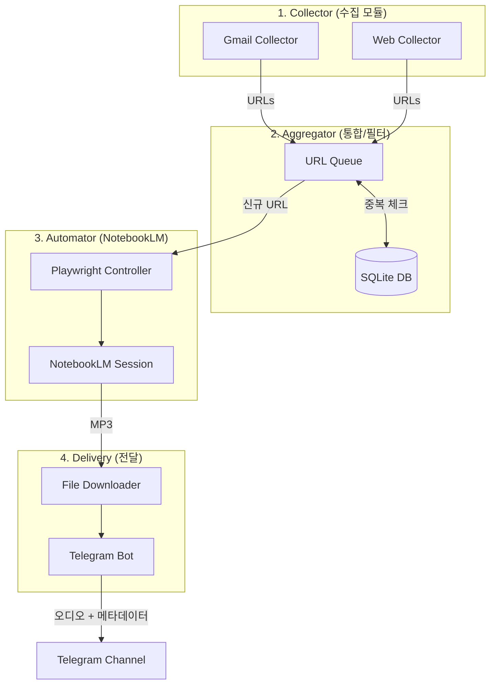

# [상세 설계서] LetterCast Pro - 시스템 아키텍처

## 1. 시스템 전체 구조



## 2. 모듈별 인터페이스 설계

### 2.1 Collector 모듈

```python
# collector/gmail_collector.py
class GmailCollector:
    """Gmail에서 뉴스레터 URL을 수집"""
    def __init__(self, credentials_path: str, allowed_senders: list[str]): ...
    async def fetch_unread_urls(self) -> list[CollectedItem]: ...
    async def mark_as_read(self, message_id: str) -> None: ...

# collector/web_collector.py
class WebCollector:
    """대상 웹사이트에서 최신 게시글 URL을 수집"""
    def __init__(self, target_sites: list[TargetSite]): ...
    async def fetch_latest_urls(self) -> list[CollectedItem]: ...
```

### 2.2 Aggregator 모듈

```python
# database/models.py
@dataclass
class CollectedItem:
    url: str
    title: str
    source: str           # "gmail" | "web"
    source_name: str      # 발신자 또는 사이트명
    collected_at: datetime

class ProcessingStatus(Enum):
    PENDING = "pending"
    PROCESSING = "processing"
    COMPLETED = "completed"
    FAILED = "failed"

# database/repository.py
class URLRepository:
    """URL 저장소 - 중복 체크 및 상태 관리"""
    def __init__(self, db_path: str): ...
    async def is_duplicate(self, url: str) -> bool: ...
    async def save(self, item: CollectedItem) -> int: ...
    async def update_status(self, url_id: int, status: ProcessingStatus) -> None: ...
    async def get_pending(self) -> list[CollectedItem]: ...
```

### 2.3 Automator 모듈

```python
# automator/notebooklm.py
class NotebookLMAutomator:
    """Playwright를 사용한 NotebookLM UI 자동화"""
    def __init__(self, chrome_user_data_dir: str): ...
    async def start_session(self) -> None: ...
    async def create_notebook(self, title: str) -> str: ...
    async def add_website_source(self, notebook_id: str, url: str) -> None: ...
    async def generate_audio(self, notebook_id: str) -> str: ...
    async def download_audio(self, notebook_id: str, save_dir: str) -> Path: ...
    async def cleanup_notebook(self, notebook_id: str) -> None: ...
    async def close_session(self) -> None: ...
```

### 2.4 Delivery 모듈

```python
# delivery/telegram.py
class TelegramDelivery:
    """텔레그램 채널로 오디오 전송"""
    def __init__(self, bot_token: str, channel_id: str): ...
    async def send_audio(self, file_path: Path, title: str, source_url: str) -> bool: ...
```

## 3. 데이터베이스 스키마

```sql
CREATE TABLE processed_urls (
    id          INTEGER PRIMARY KEY AUTOINCREMENT,
    url         TEXT NOT NULL UNIQUE,
    url_hash    TEXT NOT NULL UNIQUE,    -- SHA-256 해시 (빠른 조회용)
    title       TEXT,
    source      TEXT NOT NULL,           -- 'gmail' | 'web'
    source_name TEXT,
    status      TEXT DEFAULT 'pending',  -- pending | processing | completed | failed
    error_msg   TEXT,                    -- 실패 시 에러 메시지
    collected_at TIMESTAMP DEFAULT CURRENT_TIMESTAMP,
    completed_at TIMESTAMP,
    created_at   TIMESTAMP DEFAULT CURRENT_TIMESTAMP
);

CREATE INDEX idx_url_hash ON processed_urls(url_hash);
CREATE INDEX idx_status ON processed_urls(status);
```

## 4. 설정 스키마

```yaml
# config/settings.yaml
gmail:
  credentials_path: "config/credentials.json"
  token_path: "config/token.json"
  allowed_senders:
    - "newsletter@example.com"
    - "digest@techblog.com"
  max_results: 10

web_sources:
  - name: "TechBlog"
    url: "https://example.com/blog"
    type: "rss"                     # rss | html
    rss_url: "https://example.com/feed"
  - name: "NewsSite"
    url: "https://news.example.com"
    type: "html"
    selector: "article a:first-of-type"  # CSS 선택자

notebooklm:
  chrome_user_data_dir: "~/Library/Application Support/Google/Chrome"
  chrome_profile: "Default"
  timeout_seconds: 300              # 오디오 생성 최대 대기
  retry_count: 2

telegram:
  bot_token: "${TELEGRAM_BOT_TOKEN}"
  channel_id: "${TELEGRAM_CHANNEL_ID}"

storage:
  db_path: "data/lettercast.db"
  temp_audio_dir: "data/tmp"
  max_age_hours: 24                  # 이 시간 이전 콘텐츠는 스킵
```

## 5. 에러 핸들링 전략

| 상황 | 전략 | 재시도 |
|---|---|---|
| Gmail API 할당량 초과 | 지수 백오프 후 재시도, 초과 시 다음 실행까지 대기 | 최대 3회 |
| 웹사이트 접속 불가 | 해당 URL 스킵, `FAILED` 상태 기록 | 최대 2회 |
| NotebookLM 페이지 로드 타임아웃 | 세션 재시작 후 재시도 | 최대 2회 |
| 오디오 생성 타임아웃 (5분 초과) | 노트북 삭제 후 재시도 | 최대 1회 |
| 텔레그램 전송 실패 | 지수 백오프 후 재시도 | 최대 3회 |
| 크롬 프로필 잠금 | 기존 크롬 프로세스 종료 안내 로그 출력 | 재시도 없음 |

---
*Generated by Gemini 2.0 Flash*
