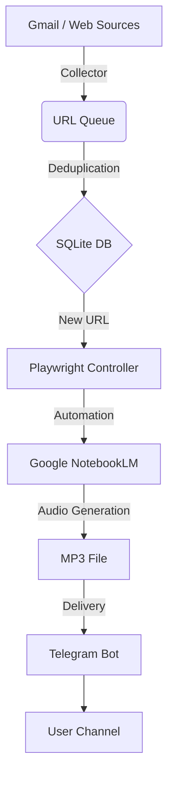

# [확정] 기술 스택 및 개발 환경 (Tech Stack & Environment)

본 프로젝트 **LetterCast Pro**는 데이터 수집의 안정성과 자동화의 효율성을 최우선으로 고려하여, 아래와 같은 **Python 중심의 기술 스택**으로 개발을 진행합니다.

## 1. 핵심 기술 스택 (Core Stack)

### 1.1 프로그래밍 언어
*   **Python 3.11+**: 최신 비동기 기능(`asyncio`)을 활용하여 I/O 바운드 작업(네트워크 요청, 브라우저 제어)의 성능을 극대화합니다.

### 1.2 브라우저 자동화 (RPA)
*   **Playwright for Python**: 
    *   Selenium 대비 빠른 속도와 강력한 최신 웹 표준 지원.
    *   **User Data Directory 연동**: 로컬 크롬 프로필을 로드하여 구글 로그인 세션을 유지, 캡차(CAPTCHA) 및 2단계 인증 이슈를 최소화합니다.
    *   **Trace Viewer**: 디버깅 시 자동화 과정을 시각적으로 분석 가능.

### 1.3 데이터 수집 (Collection)
*   **Gmail API**: `google-api-python-client`를 사용하여 안정적으로 뉴스레터를 필터링하고 본문 링크를 추출합니다.
*   **Web Scraping**: 
    *   `BeautifulSoup4`: 정적 페이지 파싱.
    *   `feedparser`: RSS 피드 지원 사이트 처리.

### 1.4 데이터베이스 & 스토리지
*   **SQLite**: 서버리스 로컬 DB로, 처리된 URL(`url_hash`)을 저장하여 중복 생성을 방지합니다.
*   **Local File System**: 생성된 MP3 파일의 임시 저장소로 사용합니다.

### 1.5 메신저 연동
*   **Python-Telegram-Bot**: 비동기 래퍼를 사용하여 오디오 파일 업로드 및 알림 발송을 처리합니다.

## 2. 개발 환경 및 도구 (Dev Tools)

*   **패키지 매니저**: `Poetry` (의존성 관리 및 가상환경 격리)
*   **린터/포매터**: `Ruff` (빠른 속도의 Python 린터), `Black` (코드 포매팅)
*   **테스트 프레임워크**: `pytest` (단위 테스트 및 시나리오 테스트)
*   **버전 관리**: `Git`

## 3. 시스템 아키텍처 다이어그램

---
*Generated by Gemini 2.0 Flash*
