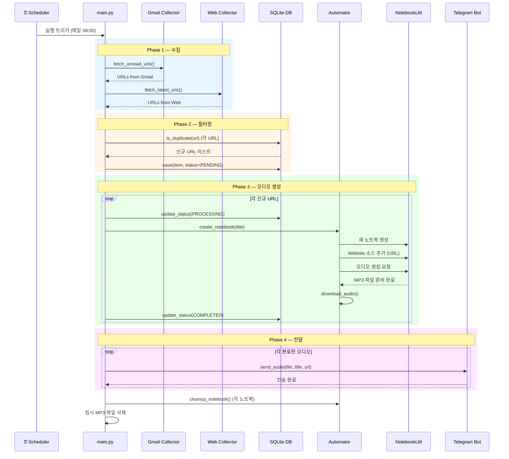
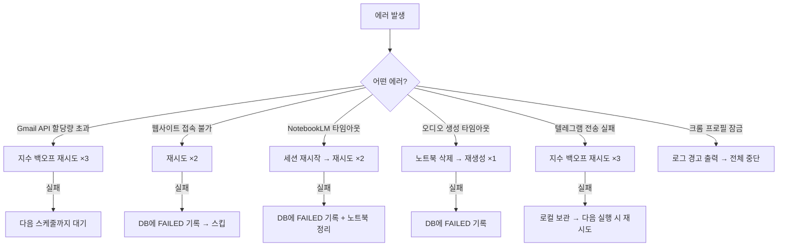

# [실행 흐름 시나리오] LetterCast Pro - Workflow

## 1. 전체 실행 흐름 (정상 케이스)



## 2. 단계별 상세 흐름

### Phase 1: 수집 (Collect)
```
1. Gmail Collector 실행
   ├─ OAuth 토큰으로 Gmail API 인증
   ├─ ALLOWED_SENDERS 리스트로 '읽지 않음' 메일 검색
   ├─ 각 메일 본문에서 정규표현식으로 메인 URL 추출
   └─ 추출된 URL + 메타데이터를 CollectedItem으로 반환

2. Web Collector 실행
   ├─ TARGET_WEBSITES 리스트 순회
   ├─ [RSS 있음] → feedparser로 최신 엔트리 URL 추출
   ├─ [RSS 없음] → Playwright로 페이지 접속 → CSS 선택자로 링크 추출
   └─ 추출된 URL + 메타데이터를 CollectedItem으로 반환
```

### Phase 2: 필터링 (Filter)
```
1. 모든 CollectedItem을 하나의 큐로 통합
2. 각 URL에 대해:
   ├─ SHA-256 해시 생성
   ├─ DB에서 url_hash 조회 → 이미 존재하면 스킵
   ├─ 수집 시간이 max_age_hours 이전이면 스킵
   └─ 신규 URL → DB에 PENDING 상태로 저장
```

### Phase 3: 오디오 생성 (Generate)
```
1. Playwright로 크롬 프로필 세션 시작
2. 각 PENDING URL에 대해:
   ├─ DB 상태 → PROCESSING으로 변경
   ├─ NotebookLM 접속 → 새 노트북 생성
   ├─ "Add Source" → "Website" 클릭
   ├─ URL 입력 → "Insert" 클릭
   ├─ 소스 분석 완료 대기 (폴링)
   ├─ "Audio Overview" → "Generate" 클릭
   ├─ 오디오 생성 완료 대기 (최대 5분)
   ├─ MP3 다운로드 → data/tmp/ 저장
   └─ DB 상태 → COMPLETED로 변경
3. 브라우저 세션 종료
```

### Phase 4: 전달 (Deliver)
```
1. COMPLETED 상태의 모든 항목 조회
2. 각 항목에 대해:
   ├─ 텔레그램 봇으로 MP3 파일 전송
   ├─ 캡션: 제목 + 원문 URL
   └─ Gmail 원본 → '읽음' 처리
3. 임시 MP3 파일 삭제
4. (선택) NotebookLM 노트북 삭제
```

## 3. 실패 시나리오별 처리



## 4. 스케줄링 계획

### cron 설정 (macOS)

```bash
# crontab -e
# 매일 오전 8시 실행
0 8 * * * cd /path/to/letter-cast && /path/to/poetry run python -m src.main >> data/logs/cron.log 2>&1
```

### 대안: launchd (macOS 네이티브)

```xml
<!-- ~/Library/LaunchAgents/com.lettercast.daily.plist -->
<?xml version="1.0" encoding="UTF-8"?>
<!DOCTYPE plist PUBLIC "-//Apple//DTD PLIST 1.0//EN"
  "http://www.apple.com/DTDs/PropertyList-1.0.dtd">
<plist version="1.0">
<dict>
    <key>Label</key>
    <string>com.lettercast.daily</string>
    <key>ProgramArguments</key>
    <array>
        <string>/path/to/poetry</string>
        <string>run</string>
        <string>python</string>
        <string>-m</string>
        <string>src.main</string>
    </array>
    <key>WorkingDirectory</key>
    <string>/path/to/letter-cast</string>
    <key>StartCalendarInterval</key>
    <dict>
        <key>Hour</key>
        <integer>8</integer>
        <key>Minute</key>
        <integer>0</integer>
    </dict>
    <key>StandardOutPath</key>
    <string>/path/to/letter-cast/data/logs/launchd.log</string>
    <key>StandardErrorPath</key>
    <string>/path/to/letter-cast/data/logs/launchd_error.log</string>
</dict>
</plist>
```

```bash
# launchd 등록
launchctl load ~/Library/LaunchAgents/com.lettercast.daily.plist
```

## 5. 로깅 전략

| 레벨 | 용도 | 예시 |
|---|---|---|
| `INFO` | 주요 단계 진행 | `[Collector] 3개 URL 수집 완료` |
| `WARNING` | 재시도 발생 | `[Automator] 타임아웃, 재시도 1/2` |
| `ERROR` | 처리 실패 | `[Delivery] 텔레그램 전송 실패: 413 파일 초과` |
| `DEBUG` | 상세 디버깅 | `[Collector] 메일 ID msg_abc123 파싱 중` |

```python
# 로그 출력 형식
# 2026-02-27 08:00:05 | INFO | collector.gmail | 읽지 않은 메일 5건 발견
# 2026-02-27 08:00:12 | INFO | collector.web   | TechBlog: 신규 URL 1건
# 2026-02-27 08:01:30 | INFO | automator       | 오디오 생성 시작 (1/3)
# 2026-02-27 08:05:45 | INFO | delivery        | 텔레그램 전송 완료 (1/3)
```

---
*Generated by Gemini 2.0 Flash*
